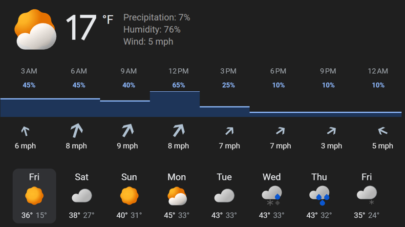

# TRMNL Weather App

A custom weather plugin for [TRMNL](https://usetrmnl.com/) e-ink displays. Fetches weather data from the free [Open-Meteo API](https://open-meteo.com/) and pushes formatted HTML to your TRMNL device via webhook.



## Features

- Current conditions: temperature, precipitation, humidity, wind
- 24-hour precipitation forecast with bar chart (3-hour intervals)
- Wind direction arrows and speed for each interval
- 7-day forecast with high/low temps and weather icons
- No API keys needed for weather data (Open-Meteo is free)
- Runs on a 3-hour update schedule or as a one-shot command

## Setup

### 1. Create a TRMNL Private Plugin

1. Log into your [TRMNL dashboard](https://usetrmnl.com/dashboard)
2. Go to **Plugins** > **Private Plugin** > **Create**
3. Set the strategy to **Webhook**
4. In the **Markup** editor, paste:
   ```liquid
   {{ markup }}
   ```
5. Save the plugin and copy the **Plugin UUID** from the plugin URL
6. Copy your **API Key** from your TRMNL account settings

### 2. Configure the App

Edit `config.py` with your settings:

```python
LATITUDE = 40.7128        # Your latitude
LONGITUDE = -74.0060      # Your longitude
TRMNL_PLUGIN_UUID = "your-plugin-uuid-here"
TRMNL_API_KEY = "your-api-key-here"
TEMPERATURE_UNIT = "fahrenheit"  # or "celsius"
WIND_SPEED_UNIT = "mph"         # or "kmh"
UPDATE_INTERVAL_HOURS = 3
```

Find your coordinates at [latlong.net](https://www.latlong.net/).

### 3. Install and Run

```bash
pip install -r requirements.txt

# Test with a single update
python server.py --once

# Run continuously (updates every 3 hours)
python server.py
```

## File Structure

- `server.py` - Main script: fetches data, generates markup, pushes to TRMNL
- `config.py` - User configuration (location, API keys, units)
- `weather.py` - Open-Meteo API client and data parser
- `markup.py` - HTML/CSS markup generator for the e-ink display layout
